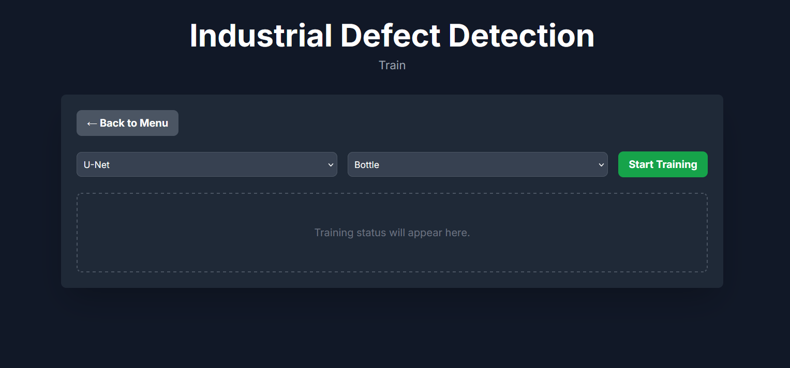
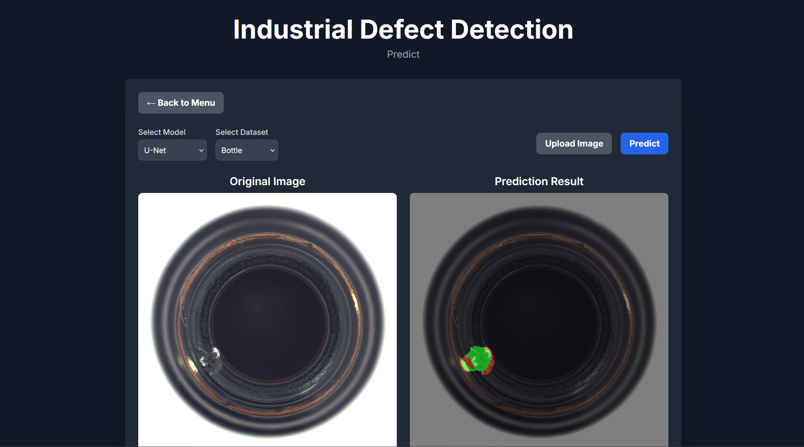
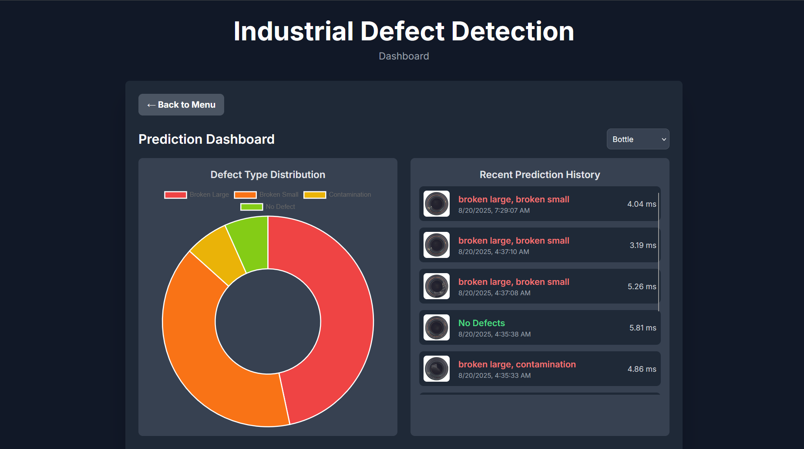

# 🧠 Industrial Defect Detection with Web UI

This project provides an end-to-end solution for industrial defect detection using advanced segmentation models. It features a user-friendly web interface for training models, running predictions, and visualizing results. The backend is built with **FastAPI** and the entire application is containerized with **Docker**.

---

## ✨ Features

-   **Interactive Web Interface**: A multi-page UI for all major operations.
-   **Multiple Model Support**: Train and predict with different segmentation architectures like **U-Net** and **DeepLabV3+**.
-   **Multiple Dataset Support**: Easily switch between different datasets for training and prediction.
-   **Real-time Prediction**: Upload an image to get a visual segmentation mask, a list of detected defects, and performance metrics.
-   **Live Training Dashboard**: Start the training process from the UI and monitor progress with a real-time chart showing loss and validation scores.
-   **Prediction Dashboard**: View a summary of historical predictions for each dataset, including a defect distribution chart and a log of recent predictions.

---

## 🚀 Getting Started

Follow these steps to prepare the dataset, build the Docker image, and run the application.

### 1. 📁 Dataset Setup

This project is configured to use datasets like the **MVTec AD (Anomaly Detection)** dataset. This project used data from MVTEC AD Dataset, you can download it on the link below
- **Dataset**: [MVTec AD Dataset](https://www.mvtec.com/company/research/datasets/mvtec-ad)  

-   **Prepare Your Data**: Place your dataset folders (e.g., `bottle`, `tile`) inside the `data/processed/` directory. Each dataset folder must contain `train` and `test` subdirectories, which in turn contain folders for each class (e.g., `good`, `contamination`). A `ground_truth` folder with binary masks is also required.

    ```
    data/
    └── processed/
        └── bottle/
            ├── train/
            │   └── good/
            ├── test/
            │   ├── good/
            │   ├── contamination/
            └── ground_truth/
                └── contamination/
    ```

-   **Preprocess Masks (Crucial Step)**: Before training a multi-class model, you must convert your binary ground truth masks into a multi-class format. Run the provided preprocessing script from your terminal. It will automatically find all your datasets and process them.

    ```bash
    python src/data/preprocess_masks.py
    ```

    This will create a `labels.json` file and a `ground_truth_multiclass` folder inside each dataset directory.

### 2. 🐳 Docker Deployment

-   **Build the Docker Image**: From the project's root directory, run:

    ```bash
    docker build -t defect-detector-app -f deployment/Dockerfile .
    ```

-   **Run the Docker Container**:
    -   **For CPU**: The `--shm-size` flag is critical to prevent training errors.
        ```bash
        docker run -p 8000:8000 --shm-size="512m" --name defect-detector-instance defect-detector-app
        ```
    -   **For GPU (Recommended)**: You must have the [NVIDIA Container Toolkit](https://docs.nvidia.com/datacenter/cloud-native/container-toolkit/latest/install-guide.html) installed.
        ```bash
        docker run -p 8000:8000 --shm-size="2g" --gpus all --name defect-detector-instance defect-detector-app
        ```

Once running, the application is accessible at 👉 `http://127.0.0.1:8000`

---

## ⚙️ Application Usage

The web interface is the primary way to interact with the application.

### Main Menu

From the main menu, you can navigate to one of three pages:

### 1. Train Model Page

Here you can train a new model.

-   **Select Model**: Choose between `U-Net` and `DeepLabV3+`.
-   **Select Dataset**: Choose the dataset you want to train on from the dropdown.
-   **Start Training**: Click the button to begin the training process. The UI will display a chart showing the training loss and validation score (mIoU) for each epoch.



### 2. Predict Defects Page

This page allows you to use a trained model to find defects.

-   **Select Model & Dataset**: Choose the model architecture and the dataset it was trained on.
-   **Upload Image**: Upload an image from your computer.
-   **View Results**: The UI will display the original image alongside the prediction, which shows a colored mask overlaid on any detected defects. Below the images, you will see:
    -   **Inference Time**: The time taken for the prediction in milliseconds.
    -   **Defect Status**: A summary of whether defects were found.
    -   **Defect Details**: A list of each classified defect and its quantified area.
    -   **Color Legend**: An explanation of what each color in the mask represents.



### 3. Dashboard Page

This page provides a high-level overview of the prediction history.

-   **Select Dataset**: Choose a dataset to view its specific statistics.
-   **Defect Distribution**: A chart shows the total count of each defect type that has been detected over time.
-   **Recent Prediction History**: A log displays the most recent predictions, including a thumbnail of the image, the detected defects, and the timestamp.



---

### 🖥️ Alternative: Local Training

You can also train a model locally without using the UI. This is useful for pre-training models before building your Docker image.

1.  **Configure**: Open the `config/config.yaml` file.
2.  **Set Model**: Change the `active_model_architecture` to `unet` or `deeplabv3plus`.
3.  **Set Dataset**: Change the `product_name` to the dataset you want to train on (e.g., `bottle`).
4.  **Run**: Execute the training script from your terminal:
    ```bash
    python src/train.py
    ```

This will generate the model file in the `models/final/` directory. When you build the Docker image, this pre-trained model will be included.

---